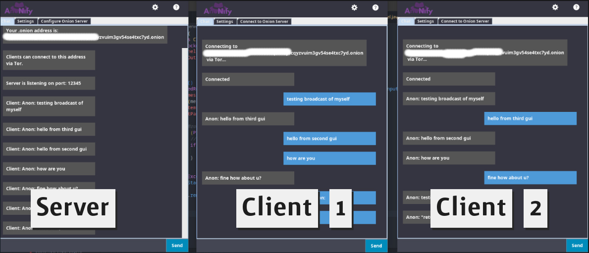

<div align="center">
  

  <p align="center">
    <strong>Open-source onion-secured one-to-one communication platform.</strong>    
  </p>

  <hr>

  
  
  


</div>

A secure and anonymous chat platform designed for private one-to-one communication. with a focus on privacy, AnoNify routes all communications via the Tor network.

- **🔐 End-to-end encryption**: All messages are secured using advanced encryption protocols.
- **🧅 Onion Routing**: Communication is routed through Tor for robust anonymity.
- **📲 Lightweight Interface**: Simple and user-friendly interface for seamless communication.
- **🚀 Open-source**: Fully transparent and community-driven development.

<strong>This project was inspired by [dontTrust](https://github.com/Alvorada9999/dont_trust).</strong>

<div align="center">



</div>

## 📚 Documentation Index

### **Backlog and Project Description**
- [📌 Product Backlog](/docs/backlog/backlog.md)
- [📋 First Sprint Backlog](/docs/backlog/SprintBacklog.md)

### **Diagrams**
- [📐 UML Diagrams](/docs/uml/class_diagram.md)

### **Prototypes**
- [🖌️ UI Prototypes](/docs/diagrams/diagrams.md)

## 🚀 Installation & Usage

### Prerequisites
- **Java JDK 11 or higher**
- **Tor service** (installed and running on your system)
- A **modern IDE** such as IntelliJ IDEA or Eclipse for development.

### Setting Up
1. Clone the repository:
   ```bash
   git clone https://github.com/iyksh/AnoNify.git
   cd AnoNify
   ```
2. Configure Tor:
   - Ensure `tor` is running and accessible through `ControlPort` (default: 9051) and `SOCKSPort` (default: 9050).
   - Optional: Use the `tor.sh` file provided in the `/scripts/` directory for quick setup.

3. Build and Run:
   ```bash
   ./run.sh
   ```

4. Access the interface and start chatting anonymously.


