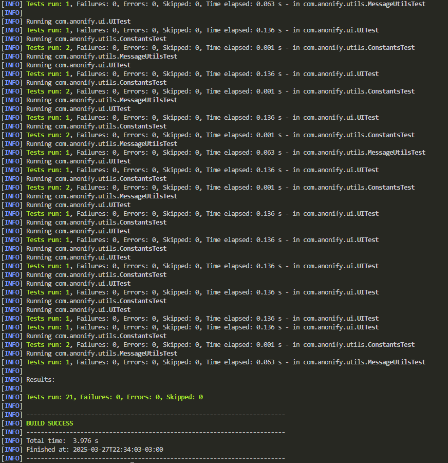

<div align="center">
  

<p align="center">
    <strong>Open-source onion-secured one-to-one communication platform.</strong>  
  </p>

<hr>

  
  
  

</div>

A secure and anonymous chat platform designed for private one-to-one communication. with a focus on privacy, AnoNify routes all communications via the Tor network.

- **🔐 End-to-end encryption**: All messages are secured using advanced encryption protocols.
- **🧅 Onion Routing**: Communication is routed through Tor for robust anonymity.
- **📲 Lightweight Interface**: Simple and user-friendly interface for seamless communication.
- **🚀 Open-source**: Fully transparent and community-driven development.

`<strong>`This project was inspired by [dontTrust](https://github.com/Alvorada9999/dont_trust).`</strong>`

<div align="center">


</div>

## 📚 Documentation Index

### **Backlog and Project Description**

- [📌 Product Backlog](/docs/backlog/backlog.md)
- [📋 First Sprint Backlog](/docs/backlog/SprintBacklog.md)

### **Diagrams**

- [📐 UML Diagrams](/docs/uml/class_diagram.md)

### **Prototypes**

- [🖌️ UI Prototypes](/docs/diagrams/diagrams.md)

## 🚀 Installation & Usage

### Prerequisites

- **Java JDK 11 or higher**
- **Tor service** (installed and running on your system)
- A **modern IDE** such as IntelliJ IDEA or Eclipse for development.

### Setting Up

1. Clone the repository:

   ```bash
   git clone https://github.com/iyksh/AnoNify.git
   cd AnoNify
   ```
2. Configure Tor:

   - Ensure `tor` is running and accessible through `ControlPort` (default: 9051) and `SOCKSPort` (default: 9050).
   - Optional: Use the `tor.sh` file provided in the `/scripts/` directory for quick setup.
3. Build and Run:

   ```bash
   ./run.sh
   ```
4. Access the interface and start chatting anonymously.

## 🧪 Testing

This project uses [JUnit 5 (JUnit Jupiter)](https://junit.org/junit5/) and [Mockito](https://site.mockito.org/) for automated testing. Tests are configured in the Maven build and are located in a custom directory **tests** (as configured in the `pom.xml`).

### Tests Coverage

The tests cover key aspects of the system:

* **Services:**

  Tests for methods such as port validation and error handling in Services, TorClientService, and TorServerService.
* **UI Components:**

  * **ChatPanelTest:** Verifies that messages are added, cleared, and that help messages are displayed correctly.
  * **CustomScrollBarUITest:** Ensures that the custom scroll buttons are created with the expected dimensions.
  * **InputPanelTest:** Checks that message sending clears the input field and calls the service appropriately.
  * **LogoPanelTest:** Verifies that the logo panel contains the expected components.
  * **TabManagerTest:** Validates tab management functionality.
* **UI Panels:**

  * **ConfigureOnionPanelTest:** Verifies the presence of UI elements for configuring the onion server.
  * **ConnectOnionPanelTest:** Checks that the connect panel displays the proper fields and title.
  * **SettingsPanelTest:** Confirms that settings are displayed and that the expected buttons (e.g., for configuring or connecting to an onion server) are present.
* **Main UI:**

  * **MainFrameTest:** Ensures that the main frame is created with correct properties such as title, size, and layout.
  * **UITest:** Checks that the main UI initializes properly and that sending a message updates the ChatPanel.

### Running the Tests

Make sure you have Maven installed and configured. Then, from the root directory of the project, run:

```bash
mvn test
```

The Maven Surefire Plugin will compile the tests (using the custom test source directory configured in the `pom.xml`) and execute them. Detailed reports are generated in the `target/surefire-reports` directory.



### Example pom.xml (Complete)

Below is a complete example of a **pom.xml** configured for Java 16, JUnit Jupiter, Mockito, and using a custom test source directory (`tests`):

```xml
<project xmlns="http://maven.apache.org/POM/4.0.0" 
         xmlns:xsi="http://www.w3.org/2001/XMLSchema-instance"
         xsi:schemaLocation="http://maven.apache.org/POM/4.0.0 
                             http://maven.apache.org/xsd/maven-4.0.0.xsd">
  <modelVersion>4.0.0</modelVersion>

  <groupId>com.anonify</groupId>
  <artifactId>anonify</artifactId>
  <version>1.0-SNAPSHOT</version>
  <packaging>jar</packaging>

  <properties>
    <maven.compiler.source>16</maven.compiler.source>
    <maven.compiler.target>16</maven.compiler.target>
    <project.build.sourceEncoding>UTF-8</project.build.sourceEncoding>
    <junit.jupiter.version>5.9.2</junit.jupiter.version>
    <mockito.version>4.8.0</mockito.version>
  </properties>

  <dependencies>
    <!-- JUnit Jupiter API -->
    <dependency>
      <groupId>org.junit.jupiter</groupId>
      <artifactId>junit-jupiter-api</artifactId>
      <version>${junit.jupiter.version}</version>
      <scope>test</scope>
    </dependency>
    <!-- JUnit Jupiter Engine -->
    <dependency>
      <groupId>org.junit.jupiter</groupId>
      <artifactId>junit-jupiter-engine</artifactId>
      <version>${junit.jupiter.version}</version>
      <scope>test</scope>
    </dependency>
    <!-- Mockito -->
    <dependency>
      <groupId>org.mockito</groupId>
      <artifactId>mockito-core</artifactId>
      <version>${mockito.version}</version>
      <scope>test</scope>
    </dependency>
  </dependencies>

  <build>
    <!-- Configure source and test directories -->
    <sourceDirectory>${basedir}/src</sourceDirectory>
    <testSourceDirectory>${basedir}/tests</testSourceDirectory>
  
    <plugins>
      <!-- Maven Compiler Plugin -->
      <plugin>
        <groupId>org.apache.maven.plugins</groupId>
        <artifactId>maven-compiler-plugin</artifactId>
        <version>3.13.0</version>
        <configuration>
          <source>${maven.compiler.source}</source>
          <target>${maven.compiler.target}</target>
        </configuration>
      </plugin>
      <!-- Maven Surefire Plugin for JUnit 5 -->
      <plugin>
        <groupId>org.apache.maven.plugins</groupId>
        <artifactId>maven-surefire-plugin</artifactId>
        <version>3.0.0-M7</version>
        <configuration>
          <useModulePath>false</useModulePath>
        </configuration>
      </plugin>
    </plugins>
  </build>
</project>
```

---
